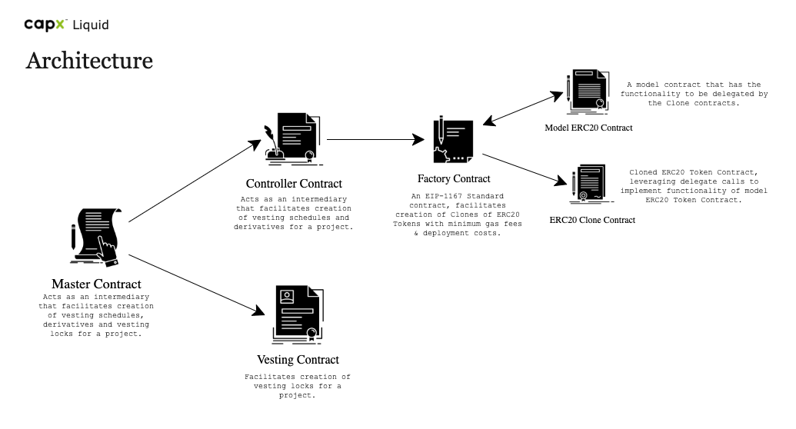

Vesting - Derivative Asset Creation 
====================================

The project provides a decentralized platform allowing token creators, developers and token holders to create a "*Smart Vesting Contract*" to hold their ERC20 Tokens for a specific period of time and provide them with a wrapped ERC20 Token derived from the locked token depending on the user's choice.<br />
This creates trust in the token community and prevents spams and '*rug pulls*'. The platform also provides tradability of this derived asset. Once, the vesting schedule has elapsed, the derived asset are the *key* to attain the vested ERC20 Token.

>**Vesting** definition - *In law, vesting is the point in time when the rights and interests arising from legal ownership of a property is acquired by some person.*

Concerning Issues
-------------------

* `Creation of Wrapped Assets` Deployment of a new ERC20 Token (wrapped asset) is high & expensive.
* `Tracking of Wrapped Asset` As the derived assets are being transferred the data should be consistent w.r.t the holder of the wrapped assets.

Solution
-------------------

* `Creation of Wrapped Assets` - To reduce the cost of Deployment of the new ERC20 Token, [EIP-1167 Standard](https://eips.ethereum.org/EIPS/eip-1167) standard is used. The tokens created using **EIP-1167 Standard** are fully functional ERC20 Tokens.
* `Tracking of Wrapped Asset` - Using **Events** to handle this.

Architecture
-------------------



Deploying the Smart Contracts
================================

The deployment script is written in the migrations file "1_initial_migration".
This project has total of 5 contracts which are deployed in succession with multiple functions called in between.

## How to deploy a contract in migration files

Normal Deployment
```js
const instanceVariable = await deployer.deploy(contractVariable, contructorArguments)
```
Deployment with proxy
```js
const instanceVariable = await deployProxy(contractVariable, [args], { kind: 'uups' });
```

## Step 1

Importing the contracts

```javascript
const master = artifacts.require("Master")
const controller = artifacts.require("Controller");
const model = artifacts.require("ERC20CloneContract");
const factoryContract = artifacts.require("ERC20Factory");
const vest = artifacts.require("Vesting");
```

## Step 2 

Gets the accounts to be used for deployment

```javascript
const accounts = await web3.eth.getAccounts();
```

## Step 3

Deploys master contract using openzeppelin upgradable plugin. 

```javascript
let masterInstance = await deployProxy(master, [], { kind: 'uups' });
```

## Step 4

Deploys controller contract using openzeppelin upgradable plugin. 

```javascript
let controllerInstance = await deployProxy(controller, [masterInstance.address], { kind: 'uups' });
```

## Step 5

Deploy ERC20Model contract and ERC20factory contract which uses the model and the controller address in its constructors

```javascript

let erc20model = await deployer.deploy(model);

let erc20factory = await deployer.deploy(factoryContract, erc20model.address, controllerInstance.address);

```

## Step 6

Set Factory and Liquid controller address in the master by calling the `setLiquidFactory` and `setLiquidController` functions

```javascript
await masterInstance.setLiquidFactory(erc20factory.address);

await masterInstance.setLiquidController(controllerInstance.address);
```

## Step 7

Deploy Vesting contract 

```javascript
let vestingInstance = await deployProxy(vest, [], { kind: 'uups' });
```

## Step 8

Set addresses in vesting contract and master contract

```javascript
await masterInstance.setVestingController(vestingInstance.address);

await vestingInstance.setMaster(masterInstance.address);
```

### Run Migrate to deploy the contracts.
> truffle migrate

Implementation Details 
======================

### Master Contract

The Master contract is the contract from which the user interacts with. This contract is responsible for calling the Liquid Controller and the Vesting Lock controller with appropriate inputs.
For more details see [Master.md](./ContractDocumentation/Master.md)

### Controller/ Escrow Contract

The Controller/ Escrow Contract provides the functionality of creating vesting schedules, every wrapped asset created will follow the naming convention of `<DateOfExpiry>.<TokenName>-<typeOfToken>` and symbol of `<DateOfExpiry>.<TokenSymbol>-<typeOfToken>`. <br />
The Controller/ Escrow Contract mints the wrapped assets for the end-user.
For more details see [Controller.md](./ContractDocumentation/Controller.md)

### Vesting Lock Contract

The Vesting Lock contract is the contract which is responsible for creating vesting locks. The controller contract has the following tasks. Keep the vested tokens. After the vesting time has passed, return the actual ERC20 token.
For more details see [VestingLock.md](./ContractDocumentation/VestingLock.md)

### Model ERC-20 contract

The standard ERC-20 Token smart contract from which the wrapped ERC20 contracts will be made.
For more details see [ERC20Model.md](./ContractDocumentation/ERC20Model.md) 

### ERC20 Factory

The smart contract which makes **clones** of the model ERC20 contract using [EIP-1167 standard](https://eips.ethereum.org/EIPS/eip-1167).
For more details see [ERC20Factory.md](./ContractDocumentation/ERC20Factory.md) 
